# Kiosk
- **Java 언어**를 활용한 `키오스크 프로그램`이다. 
- 콘솔에서 **메인 메뉴**를 선택하면 해당 메인 메뉴의 **하위 메뉴들**를 선택할 수 있고 선택한 항목을 장바구니에 담아 주문할 수 있는 키오스크 프로그램을 제작했다. 
- **level6**을 기준으로 Readme를 작성하였다.

## 목차 [Table of Contents]

- [메뉴 소개 [Kiosk Menu]](#메뉴-소개-kiosk-menu-)
- [주요 기능 [Features]](#주요-기능-features-)
- [프로젝트 실행 순서 [Execution Steps]](#프로젝트-실행-순서-execution-steps)
- [입력 예외 처리 [Exception Handling]](#입력-예외-처리-exception)
- [Notes](#notes)

## 메뉴 소개 [Kiosk Menu] 

### --- Main Menu ---

**Burger, Drink, Dessert** 3가지의 메뉴가 존재한다.

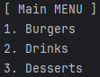

### --- Sub Menu ---

메인 메뉴마다 **4가지의 하위 메뉴**를 가진다.

Burger

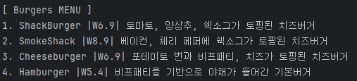

 

Drink

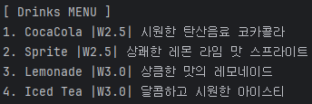

 

Dessert

## 주요 기능 [Features] 
- **메인 메뉴**와 **하위 메뉴**를 선택할 수 있다. 
- 장바구니를 통해 `선택한 메뉴를 저장하고 구매`할 수 있다. 
- 사용자가 주문을 시도하기 전에 장바구니에 담긴 `메뉴들과 총 금액을 출력`한다. 
- 사용자가 원할 시 `장바구니를 초기화`시킬 수 있다. 

 

## 프로젝트 실행 순서 [Execution Steps]
1. **메인 메뉴 선택**  

   - 사용자가 메인 메뉴에 해당하는 숫자를 입력하면 해당 메뉴와 관련된 하위 메뉴들이 출력된다.

   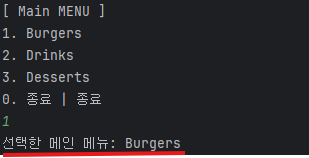
 
    

2. **하위 메뉴 선택**  

   - 사용자가 원하는 하위 메뉴 선택하면, 해당 메뉴의 정보를 출력하고 장바구니 담을지 여부를 물어본다.  

   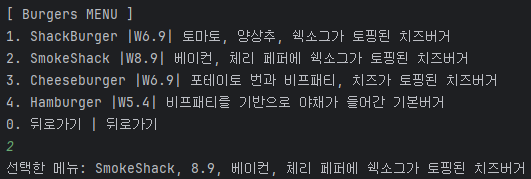

  

3. **장바구니 담기**  

   - 장바구니에 담기를 희망하면 `1`, 희망하지 않으면 `2`를 눌러 장바구니에 담을지 말지 결정한다.

   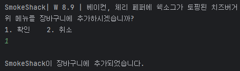  

   - 장바구니에 메뉴를 담으면 하위 메뉴 선택 화면으로 돌아가며, 해당 화면에서 `0`을 입력하면 아래와 같이 메인 메뉴 화면에 Order Menu가 생성된다. 

    

 

4. **장바구니에 담긴 메뉴 출력 및 주문하기**  

   - 장바구니에 메뉴가 담기면 [ORDER MENU]가 출력된다. 

   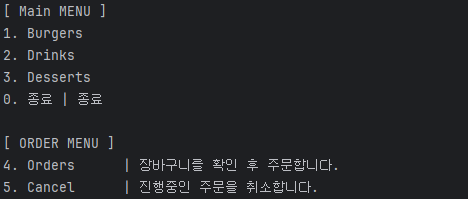

     
   
   - `4`를 누르면 장바구니에 담긴 메뉴와 총 금액을 출력한다.

    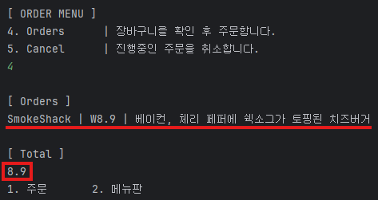  

   - 이후 `1`을 입력하면 주문이 완료되며, 프로그램이 종료된다. 

     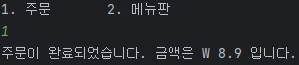

 

## 입력 예외 처리 [Exception]
잘못된 입력 시 경고 문자 출력 후 다시 메뉴 입력을 요구한다.
 

- **메뉴에 주어진 항목 외의 숫자를 누른 경우**  

    **1. 메인 메뉴**
    
    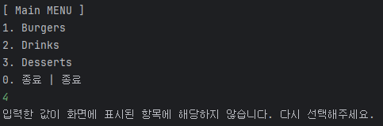
    
     
    
    **2. 서브 메뉴**
    
    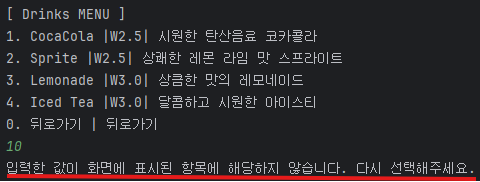
    
     
    
    **3. Order Menu**
    
    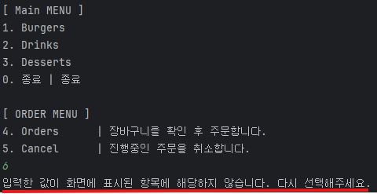
        

   

- **문자를 입력한 경우 (위의 3가지 경우에 동일하게 적용된다.)**

  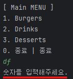

 

## Notes
 

- 본 프로젝트는 Java 프로그래밍 기초 및 예외 처리, 클래스 활용 학습을 목적으로 제작하였다. 

  

   

   

